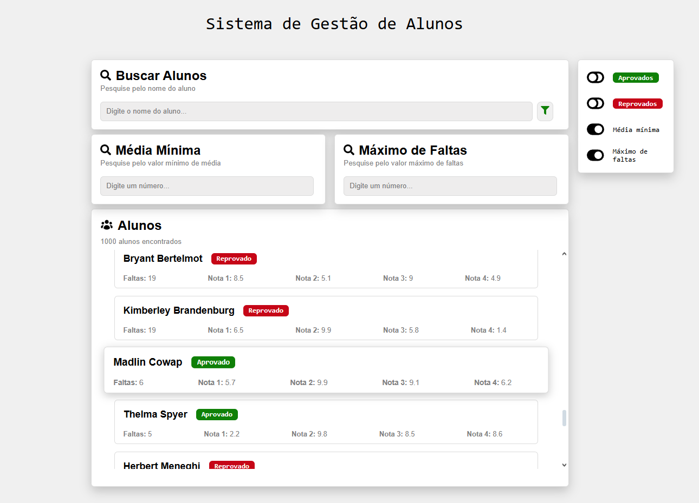

<h1>📚 Sistema de Gestão de Alunos</h1>

Projeto desenvolvido como parte de um processo seletivo da <strong>UnMEP</strong>, atendendo a todos os requisitos solicitados. 
O sistema permite <strong>visualizar e filtrar</strong> uma lista de alunos carregada a partir de um arquivo JSON, além de aplicar regras de negócio para aprovação e reprovação.

<h2>🚀 Tecnologias Utilizadas</h2>
<ul>
    <li><a href="https://react.dev/">React</a> (com <a href="https://vitejs.dev/">Vite</a>)</li>
    <li><a href="https://www.typescriptlang.org/">TypeScript</a></li>
    <li><a href="https://developer.mozilla.org/pt-BR/docs/Web/CSS">CSS</a> para estilização</li>
</ul>

<h2>📋 Funcionalidades Implementadas</h2>
<ul>
    <li><strong>Leitura do arquivo JSON</strong>
        <ul>
            <li>Carregamento local de <code>alunos.json</code> contendo 1000 registros.</li>
            <li>Exibição dos alunos em formato de tabela/lista.</li>
        </ul>
    </li>
    <li><strong>Filtros Dinâmicos</strong>
        <ul>
            <li><strong>Nome</strong>: pesquisa por primeiro e/ou último nome.</li>
            <li><strong>Média das notas</strong>: filtragem por valor mínimo de média.</li>
            <li><strong>Quantidade de faltas</strong>: busca por número máximo de faltas.</li>
        </ul>
    </li>
    <li><strong>Presets Pré-definidos</strong>
        <ul>
            <li><strong>Aprovados</strong>: média ≥ 7.0 e faltas &lt; 7</li>
            <li><strong>Reprovados</strong>:
                <ul>
                    <li>Média &lt; 7.0 → motivo: <em>Média insuficiente</em></li>
                    <li>OU faltas ≥ 7 → motivo: <em>Excesso de faltas</em></li>
                </ul>
            </li>
            <li>Exibição do <strong>motivo da reprova</strong> diretamente na tabela, ao clicar em um aluno.</li>
        </ul>
    </li>
    <li><strong>Regras de Negócio</strong>
        <ul>
            <li>Notas <code>null</code> são tratadas como <strong>0</strong>.</li>
            <li>Cálculo de média e aplicação das regras é <strong>genérica</strong> (não hardcoded).</li>
        </ul>
    </li>
    <li><strong>Interface</strong>
        <ul>
            <li>Tabela de alunos clara e organizada.</li>
            <li>Campos de filtro interativos.</li>
            <li>Botões para aplicar presets com um clique.</li>
        </ul>
    </li>
</ul>

<h2>🖥️ Pré-requisitos</h2>
<ul>
    <li><a href="https://nodejs.org/">Node.js</a> (versão 18+ recomendada)</li>
    <li>Gerenciador de pacotes <strong>npm</strong> ou <strong>yarn</strong></li>
</ul>

<h2>⚙️ Como Rodar o Projeto</h3>

<ol>
<li><strong>Clone este repositório</strong>
<pre><code>git clone https://github.com/luanbsc/Sistema-de-Gestao-de-Alunos---UnMEP</code></pre></li>

<li><strong>Entre na pasta do projeto</strong>
<pre><code>cd sistema-gestao-alunos</code></pre></li>

<li><strong>Instale as dependências</strong>
<pre><code>npm install</code></pre>
<strong>ou</strong>
<pre><code>yarn install</code></pre></li>

<li><strong>Inicie o servidor de desenvolvimento</strong>
<pre><code>npm run dev</code></pre>
<strong>ou</strong>
<pre><code>yarn dev</code></pre></li>
</ol>

Acesse a aplicação em: <a href="http://localhost:5173">http://localhost:5173</a>

<h2>📸 Screenshot</h2>

Abaixo você pode visualizar uma screenshot do sistema:

<h2>🎯 Resultado</h2>

Este projeto cumpre <strong>100% dos requisitos</strong> solicitados no desafio, entregando:

<ul>
    <li>Código <strong>organizado e claro</strong></li>
    <li>Regras de negócio bem definidas e <strong>genéricas</strong></li>
    <li>Interface funcional e responsiva</li>
</ul>

🙏 Obrigado por conferir o projeto! 
Fico à disposição para esclarecer qualquer dúvida ou discutir melhorias e novas funcionalidades. 
Espero que você tenha gostado do sistema e do cuidado com a organização e a lógica implementada. 🚀
